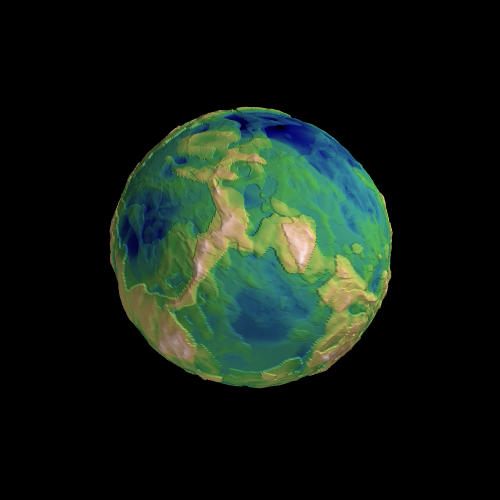
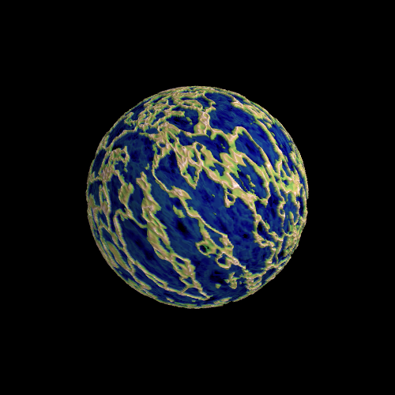
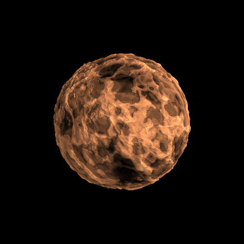
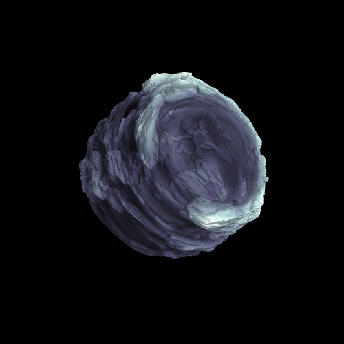

# Neural Planets
----

Neural planets is a repository for rendering planet-like spheres with topography generated from random neural networks. The design-space is intentionally crafted
to be large. With a mixture of 12 continuous and discrete design parameters (not including neural network weight parameters which can be arbitrarily large), the variety of planets is endless. This repository is dedicated to Manxin Chen.

<p align="center">
  
  
</p>

<p align="center">
  
  
  
  
</p>

### Usage
----
Usage of this software requires Python 3.6 or higher, pip, and access to a command line. To setup, run `pip install -r requirements.txt` to install the necessary python modules, and then run `pip install -e .`

#### 0. Parameters
This software utilizes [hydra-core](https://hydra.cc/docs/intro/) for handling parameter settings. For a reference of every mutable parameter and it's description, refer to the YAML files in the `config` directory.

#### 1. Generating planets
Use the `scripts/generate_planet.py` file to generate a rendering of a planet's 2D topographic projection and it's rendering onto a sphere. For example:
```
python scripts/generate_planet.py prefix=unique-identifying-prefix random_seed=30 noise_levels=8 model.radius=10 'model.layers=[64,64,64]' 'model.activations=[sigmoid,sin,tanh]' model.zdim=16 model.final_activation=tanh model.init_limit=2 model.min_delta=0.5 model.ffeats=-1 model.ffscale=1 model.noise_decay=0.35 model.noise_scale=2 colormap=gist_earth 'img_size=[500,500]'
```

#### 2. Generating animations
Generating animations requires the same parameters as above (except for the planet interpolation animation) with the addition of the `duration`, `view_distance`, `frames_per_second`, and the `animation_type` (most important) parameters. Simply add these parameters to the command and change to the `scripts/animate_planet.py` file:
```
python scripts/animate_planet.py prefix=unique-identifying-prefix random_seed=30 noise_levels=8 duration=10 view_distance=100 frames_per_second=30 animation_type=rotation
```
For brevity, I left out the command line parameters for the model.

#### 3. Planet interpolation
A special case of animations is the planet interpolation animation which corresponds to `animation_type=planet_interpolation`. This animation can interpolate between two different planet models, so it requires specification of parameters for a second neural network - this can be done in `config/other.yaml` or on the command line with the same structure as before but with the `other.[PARAMETER]` modifier.  

<p align="center">
  
</p>

For this animation, you can run something like the above command but with `animation_type=planet_interpolation`, and again for brevity, you can specify the second planet's parameters in the `config/other.yaml` file:
```
other:

  noise_levels: 20

  model:
    in_dim: 3  # input dimension of model, this is fixed
    layers: [32, 16, 8, 4]
    radius: 20
    activations: [softplus, sigmoid, sin, tanh]
    final_activation: tanh
    zdim: 4
    ffeats: -1  # dimension of fourier basis space
    ffscale: 1  # scale of randomness: higher = very squiggly, lower = less squiggly
    init_limit: 5
    noise_decay: 0.25
    noise_scale: 1
    min_delta: 0.5
```
Note that the actual `config/other.yaml` file contains comments explaining each parameter shown above.


### TODO
----
- More `_postprocess` function varieties/heuristics in `model.py`
- Finish Documentation
- GPU support
- Colormap interpolation between planets
- More animation types (interpolation of any continuous parameter)
- Flow maps on the surface
